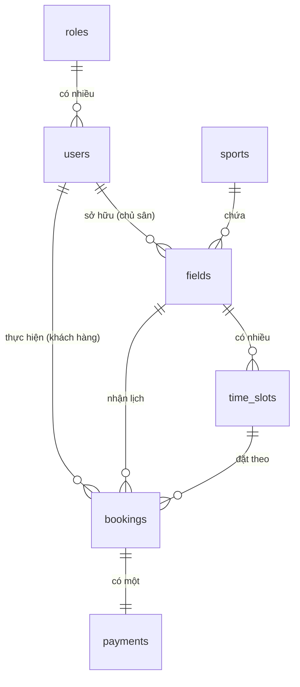

# 🏟️ PLAYMANAGEMENT - HỆ THỐNG ĐẶT LỊCH SÂN THỂ THAO

> **PlayManagement** là hệ thống quản lý đặt lịch và vận hành sân thể thao (Bóng đá, Cầu lông, Tennis...) toàn diện, hiện đại. Dự án được thiết kế tối ưu cho cả 3 đối tượng người dùng: **Chủ sân (Owner)** quản lý lịch và doanh thu, **Khách hàng (Customer)** đặt lịch và thanh toán tiện lợi, cùng **Quản trị viên (Admin)** điều hành toàn bộ hệ thống.

---

## 🚀 Tính năng nổi bật

Hệ thống được phát triển với **38 tính năng cốt lõi** chia làm 5 nhóm chính:

### 1. Khách hàng (Customer)
*   **Tìm kiếm & Lọc thông minh:** Tìm sân theo địa điểm, khoảng giá, và môn thể thao mong muốn.
*   **Đặt lịch thời gian thực:** Xem timeline khung giờ trống trực tiếp và đặt sân tức thời.
*   **Hệ thống chống đặt trùng:** Tự động kiểm tra và khóa lịch ngay khi có yêu cầu đặt, ngăn ngừa xung đột giờ.
*   **Thanh toán đa phương thức:** Hỗ trợ thanh toán Tiền mặt, Chuyển khoản, MoMo và VNPay.
*   **Quản lý lịch sử:** Theo dõi trạng thái đặt lịch (Sắp tới, Hoàn thành, Đã hủy).

### 2. Chủ sân (Owner)
*   **Dashboard trực quan:** Thống kê nhanh số sân sở hữu, lịch đặt hôm nay, yêu cầu chờ duyệt và doanh thu tháng.
*   **Quản lý sân thể thao:** CRUD thông tin sân, hình ảnh (tích hợp Cloudinary), địa chỉ và bảng giá linh hoạt theo giờ.
*   **Thiết lập khung giờ linh hoạt:** Thiết lập timeline slot riêng cho từng sân (VD: 60 phút đối với bóng đá, 90 phút đối với tennis).
*   **Duyệt lịch đặt sân:** Tiếp nhận và chuyển trạng thái đặt lịch từ `pending` sang `confirmed` hoặc `cancelled`.
*   **Báo cáo doanh thu chuyên sâu:** Biểu đồ trực quan hóa doanh thu theo ngày/tháng, tỷ lệ hủy lịch, và doanh thu trung bình từng sân.

### 3. Quản trị viên (Admin)
*   **Quản lý người dùng:** CRUD thông tin và phân quyền tài khoản (Admin, Owner, Customer).
*   **Quản lý môn thể thao:** Thêm mới và quản lý các danh mục thể thao hoạt động.
*   **Giám sát toàn cục:** Theo dõi và truy xuất toàn bộ giao dịch thanh toán, lịch đặt sân và báo cáo doanh thu toàn hệ thống.

---

## 🛠️ Công nghệ sử dụng (Tech Stack)

Hệ thống được phát triển trên nền tảng các công nghệ hiện đại và tối ưu:

| Thành phần | Công nghệ | Chi tiết sử dụng |
|---|---|---|
| **Backend** | **Laravel 13** | Framework PHP cốt lõi với cấu trúc MVC chuẩn hóa. |
| **Database** | **PostgreSQL 16** | Cơ sở dữ liệu chính, tối ưu hóa các ràng buộc dữ liệu lớn và giao dịch. |
| **Frontend** | **Blade / Tailwind CSS / Alpine.js** | Giao diện Responsive chuẩn UX, mượt mà và trực quan. |
| **Asset Bundler** | **Vite** | Biên dịch và tối ưu hóa CSS/JS tốc độ cao. |
| **Image Storage** | **Cloudinary** | Quản lý và lưu trữ hình ảnh sân thể thao trên Cloud. |
| **DevOps** | **Docker & Docker Compose** | Đồng nhất môi trường phát triển (Nginx, PHP-FPM, PostgreSQL). |

---

## 📊 Mô hình Cơ sở Dữ liệu (ERD)

Sơ đồ quan hệ thực thể mô tả cấu trúc dữ liệu của dự án:



> [!NOTE]
> Hệ thống áp dụng **Partial Unique Index** trên cơ sở dữ liệu PostgreSQL để đảm bảo không thể đặt trùng sân trong cùng một thời điểm:
> ```sql
> CREATE UNIQUE INDEX bookings_no_overlap_active_unique
> ON bookings (field_id, booking_date, time_slot_id)
> WHERE status IN ('pending', 'confirmed');
> ```

---

## ⚙️ Hướng dẫn Cài đặt & Chạy dự án

Dự án hỗ trợ 2 phương thức cài đặt và chạy dưới môi trường local:

### Cách 1: Sử dụng Docker (Khuyến nghị)

> [!IMPORTANT]
> Yêu cầu hệ thống đã cài đặt sẵn **Docker** (>= 24.x) và **Docker Compose** (>= 2.x). Cổng **80** và **5432** trên máy host phải đang trống.

1. **Clone dự án & di chuyển vào thư mục:**
   ```bash
   git clone <repository-url>
   cd CNW-PlayManagement
   ```

2. **Khởi tạo file cấu hình môi trường:**
   ```bash
   cp .env.example .env
   ```
   *(Tệp `.env` đã được cấu hình sẵn để kết nối trực tiếp đến PostgreSQL container).*

3. **Khởi động và build các container:**
   *   **Chạy chế độ thông thường:**
       ```bash
       docker compose up -d --build
       ```
   *   **Chạy chế độ phát triển (Development Mode - Cài đủ Dev dependencies):**
       ```bash
       DOCKER_TARGET=dev APP_ENV=local APP_DEBUG=true docker compose up -d --build
       ```

4. **Truy cập hệ thống:**
   *   Giao diện Web: [http://localhost](http://localhost)
   *   Cơ sở dữ liệu: `localhost:5432` (Username: `playmanagement`, Password: `playmanagement_secret`, Database: `playmanagement`).

5. **Dừng hệ thống:**
   ```bash
   docker compose down
   # Thêm flag -v nếu muốn xóa sạch dữ liệu database cũ: docker compose down -v
   ```

---

### Cách 2: Cài đặt thủ công trên máy host

> [!IMPORTANT]
> Yêu cầu máy host đã cài đặt sẵn **PHP 8.3**, **Composer**, **Node.js & NPM**, và máy chủ **PostgreSQL**.

1. **Cài đặt các gói phụ thuộc PHP & Node.js, cấu hình database và build assets:**
   Chạy lệnh cài đặt tự động được cấu hình sẵn trong `composer.json`:
   ```bash
   composer run setup
   ```
   *Lệnh này sẽ tự động: Chạy `composer install` -> Copy `.env` -> Generate APP_KEY -> Chạy DB Migration -> Chạy `npm install` -> Chạy `npm run build`.*

2. **Cấu hình môi trường:**
   Mở tệp `.env` vừa được tạo và cập nhật lại thông tin kết nối PostgreSQL của bạn:
   ```env
   DB_CONNECTION=pgsql
   DB_HOST=127.0.0.1
   DB_PORT=5432
   DB_DATABASE=your_database_name
   DB_USERNAME=your_username
   DB_PASSWORD=your_password
   ```

3. **Chạy server phát triển:**
   Chạy song song server backend, hàng đợi (queue) và Vite assets:
   ```bash
   composer run dev
   ```
   *Ứng dụng sẽ hoạt động tại địa chỉ: [http://127.0.0.1:8000](http://127.0.0.1:8000).*

---

## 🗂️ Cấu trúc Thư mục chính

```txt
CNW-PlayManagement/
├── app/
│   ├── Enums/            # Lưu trữ hằng số phân quyền (RoleEnum)
│   ├── Http/
│   │   ├── Controllers/  # Các controller xử lý logic (Admin, Owner, Auth, Api)
│   │   ├── Middleware/   # Middleware kiểm tra phân quyền (EnsureUserHasRole)
│   │   ├── Requests/     # Validation form request (Auth, User, Api)
│   │   └── Resources/    # Transform dữ liệu DB -> JSON phục vụ API Mobile
│   ├── Models/           # Eloquent Models (User, Role, Field, Booking...)
│   └── Traits/           # Trait dùng chung (VD: ApiResponse)
├── database/
│   ├── migrations/       # Định nghĩa cấu trúc bảng CSDL
│   └── seeders/          # Seeder nạp dữ liệu mẫu ban đầu
├── resources/
│   ├── views/            # Blade templates chia theo vai trò (admin, owner, customer, auth, layouts)
│   └── css/app.css       # Tailwind CSS configuration
├── routes/
│   ├── web.php           # Routes giao diện Web
│   ├── api.php           # Routes API cho Mobile App
│   └── auth.php          # Routes liên quan đến đăng nhập/đăng ký
└── tests/                # Feature & Unit tests
```

---

## 🔐 Phân quyền & Định tuyến (Auth Flow)

Hệ thống quản lý truy cập chặt chẽ thông qua Middleware `role:X` tương ứng với từng nhóm vai trò:

*   **Public (Không cần đăng nhập):** Trang chủ giới thiệu, xem danh sách sân và xem thông tin chi tiết sân.
*   **Customer (Khách hàng):** Có tiền tố route là `/customer/*`. Được bảo vệ bởi middleware `['auth', 'role:customer']`.
*   **Owner (Chủ sân):** Có tiền tố route là `/owner/*`. Được bảo vệ bởi middleware `['auth', 'role:owner']`.
*   **Admin (Quản trị viên):** Có tiền tố route là `/admin/*`. Được bảo vệ bởi middleware `['auth', 'role:admin']`.

> [!TIP]
> **Tài khoản test mặc định (sau khi chạy `--seed`):**
> *   **Admin:** `admin@playmanagement.com` | Mật khẩu: `password`
> *   **Owner:** `owner@playmanagement.com` | Mật khẩu: `password`
> *   **Customer:** `customer@playmanagement.com` | Mật khẩu: `password`

---

## 📦 Các lệnh thường dùng

### Làm việc với Docker
*   **Xem logs container:** `docker compose logs -f [service_name]` (VD: `service_name` có thể là `app`, `db` hoặc `nginx`).
*   **Chạy lệnh Artisan bên trong container:**
    ```bash
    docker compose exec app php artisan [command]
    ```
    *Ví dụ chạy migration: `docker compose exec app php artisan migrate:fresh --seed`*
*   **Kết nối nhanh vào Postgres CLI:**
    ```bash
    docker compose exec db psql -U playmanagement -d playmanagement
    ```

### Làm việc trên Host
*   **Chạy kiểm thử (Tests):** `composer run test` hoặc `php artisan test`
*   **Dọn dẹp cache cấu hình:** `php artisan config:clear && php artisan cache:clear`

---

## 📄 Bản quyền
Dự án được phân phối dưới giấy phép **MIT**. Mọi thông tin đóng góp hoặc báo cáo lỗi xin gửi về nhóm phát triển.
